# Análisis de siniestros viales en Buenos Aires

    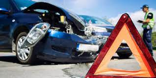

##### Nombre: Hans Steven Pulido Santiago
#### Este proyecto se enfoca en analizar y abordar la problemática de los siniestros viales en Buenos Aires. Utilizando datos proporcionados por el Observatorio de Movilidad y Seguridad Vial de la Secretaría de Transporte de la Ciudad Autónoma de Buenos Aires, se busca comprender los incidentes viales, identificar patrones, proponer estrategias preventivas y evaluar el impacto de medidas implementadas.

## Estructura de los Datos

#### Los datos originales se recibieron en un libro de Excel llamado "homicidios" con dos hojas: "hechos" y "lesiones". Inicialmente se realizó un análisis exploratorio en el notebook "1 Análisis inicial" para entender la estructura de los dataframes, sus dimensiones, la presencia de valores nulos, entre otros aspectos relevantes.

## (ETL) Extracción, Transformación y Carga

#### En el notebook "2 ETL", se llevó a cabo el proceso de ETL utilizando librerías como Numpy, Pandas, BeautifulSoup y Requests en Python. Se extrajeron datos de ambas hojas del libro de Excel, se realizaron transformaciones como la eliminación de columnas redundantes, normalización de tipos de datos y merge entre los dataframes. Se abordó la imputación de valores nulos, sustituyendo "SD" por etiquetas más descriptivas y, en algunos casos, imputando valores basados en estadísticas como la media de edades presentes en el conjunto de datos.

#### Además, se utilizó web scraping para obtener datos históricos de la población de Buenos Aires desde Wikipedia, con el objetivo de analizar la variabilidad en la población y correlacionarla con las tasas de accidentes en el período de 2016 a 2021.

## Resultados y Disponibilidad de Datos

#### El resultado del proceso ETL generó archivos CSV que permiten realizar un Análisis Exploratorio de Datos (EDA) detallado, así como la construcción de un dashboard en Power BI. Se crearon dos KPIs propuestos:

####    - Reducción de Accidentalidad: Se propone una reducción del 10% en la accidentalidad respecto al semestre anterior.

####    - Reducción de Accidentalidad en Moto: Se busca disminuir la accidentalidad en moto en un 7% respecto al año anterior.

## (EDA) Análisis Exploratorio de Datos

#### En la etapa del EDA, se utilizó Python con librerías como Pandas, Numpy, Matplotlib y warnings para explorar en profundidad los datos. Se generaron gráficos para comprender aspectos clave del problema:

####    - Tendencia de índices de accidentalidad a lo largo de los años.
####    - Cantidad de víctimas por accidente, distribución por sexo y edades.
####    - Análisis por horas para identificar picos de accidentalidad.
## Conclusiones del Análisis Exploratorio de Datos:

#### El Análisis Exploratorio de Datos arroja una panorámica detallada de la accidentalidad vial registrada, revelando varios puntos clave:

###    1- Distribución heterogénea en el número de víctimas por accidente, con mayor recurrencia en accidentes con una víctima.

    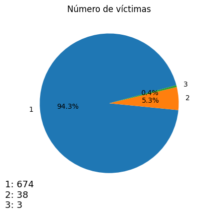

##### El anterior gráfico indica lo siguiente:
#####    - En el 94.3% de los casos hubo una víctima, para un total de 674 casos.
#####    - En el 5.3% de los casos hubo dos víctimas, para un total de 38 casos.
#####    - En el 0.4% de los casos hubo tres víctimas, para un total de 3 casos.

###    2- Tendencia al alza en la cantidad de accidentes por año, con cambios significativos entre los años, destacando un repunte en 2020.

    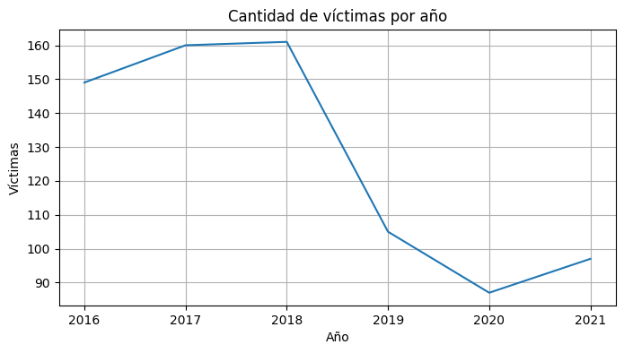

##### La información que se puede concluir del gráfico anterior:
#####    - El rango comprendido entre los años 2016 y 2018, presenta cierta tendencia al alza en los índices de accidentes de tránsito.
#####    - El rango comprendido entre 2018 y 2019 tiene la mayor disminución de la cifra de accidentes, desde un aproximado de 140 accidentes a una cifra inferior a los 110 accidentes.
#####    - Hubo un repunte de las cifras de accidentes en el año 2020.

###    3- Picos de accidentalidad en momentos específicos del día, sugiriendo la necesidad de medidas preventivas en esas franjas horarias.

    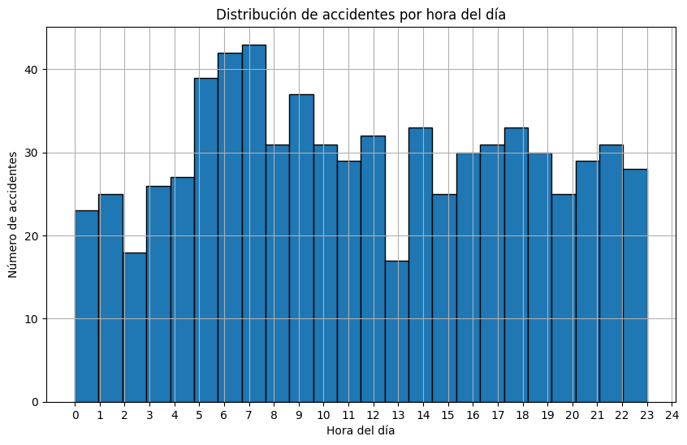

##### En el anterior histograma graficamos la distribución de accidentes por horas del día, concluímos que:
#####    - En todos los rangos horarios ocurrieron más de 10 accidentes.
#####    - En los rangos 02:00 - 03:00 y 12:30 - 13:30 aproximadamente, ocurrieron menos de 20 accidentes, lo que podría representar disminución de tráfico a esas horas. Y en todos los demás rangos ocurrieron más de 20 accidentes.
#####    - En los rangos 05:00 - 08:00 ocurren la mayor cantidad de accidentes, superando el promedio de 40 accidentes.

###    4- Variación en la frecuencia de accidentes según tipos de calles y comunas, señalando áreas específicas para mejoras en la infraestructura vial y programas de educación.

    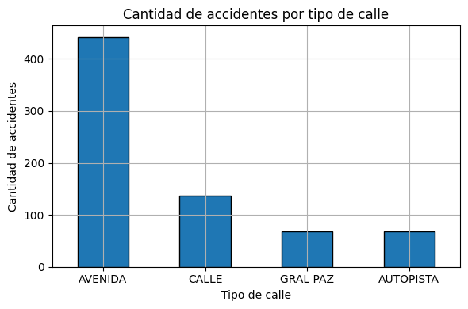

##### De acuerdo a la información del gráfico, en las avenidas se ha presentado mayor número de accidentes, con gran diferencia al superar los 400 casos; seguidas de las calles, que superan los 100 casos. Las autopistas y la General Paz tienen una cantidad cercana de casos, inferior a 100 casos.
##### Si bien las categorías serían avenidas, calles y autopistas, la General Paz no se incluye en alguna de las tres, dado que no existe un consenso sobre si es avenida o autopista.

###    5- Patrones diferenciales en la distribución por sexo de las víctimas y responsables, sugiriendo posibles disparidades en la exposición y factores de riesgo asociados.

    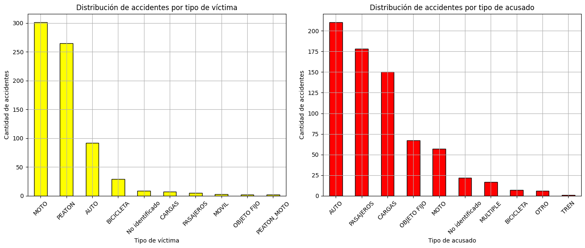

##### Se pueden derivar las siguientes conclusiones:
#####    - La mayor cantidad de víctimas en accidentes, alrededor de 300 para todo el conjunto, son ocupantes de motocicletas. Mientras que la mayor cantidad de responsables o acusados de estos accidentes son automóviles.
#####    - Los peatones son reunen la mayor cantidad de víctimas de accidentes de tráfico, solo superados por las motos.
#####    - El top 3 de víctimas en accidentes es de motos, peatones y automóviles.
#####    - El top 3 de responsables o acusados en accidentes es de automóviles, pasajeros y cargas.
#####    - Solo los automóviles se encuentran en el top 3 de ambas distribuciones.
#####    - Las bicicletas tienen baja incidencia tanto en el rol de víctimas como de acusados, podría ser considerado un vehiculo seguro.

    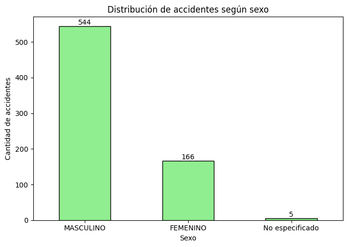

##### El gráfico muestra una notable disparidad en la cantidad de accidentes registrados entre géneros. Se observa que se reportaron 544 accidentes donde estuvieron involucrados individuos de género masculino, en comparación con 166 accidentes que implicaron individuos de género femenino. Los datos rotulados como "No especificado" obedecen a que el dataset no contaba con un valor del sexo en dicho campo, y decidimos no eliminarlos, contados como valores atípicos.

###    6- Existencia de patrones en los rangos de edad de conductores y peatones relacionados con la accidentalidad.

    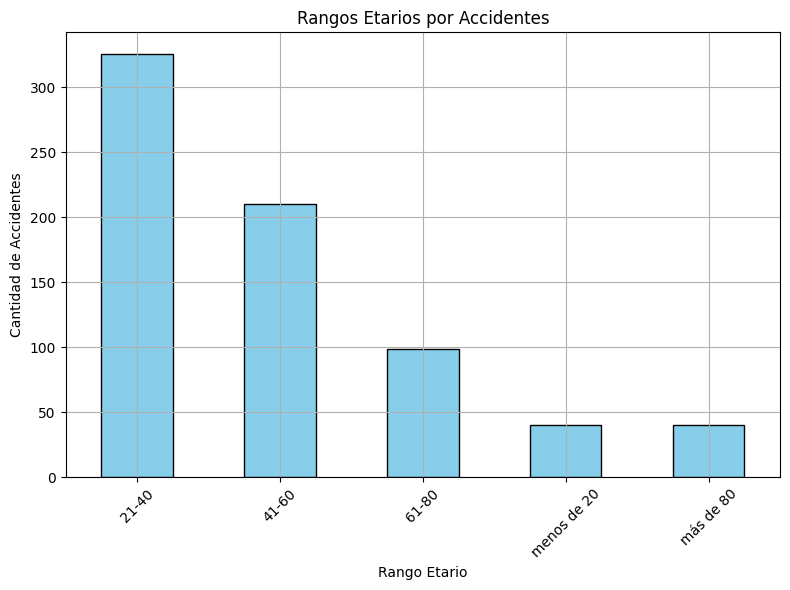

##### Del anterior gráfico puede inferirse que el rango etario 21-40 tiene mayor presencia en accidentes de tránsito, seguido del rango 41-60, acumulando entre los dos una cifra superior al 70% de los casos. Lo anterior podría explicarse por el hecho de que entre los 21 y 60 años se encuentran la mayoría de los conductores y peatones. El rango 61-80 tiene una representatividad inferior al 15% de nuestros registros. Los rangos de personas menores de 20 años y mayores de 80 años tienen cifras inferiores al 7% cada uno, por lo que serían valores atípicos.

#### Estos resultados brindan una base sólida para orientar estrategias de prevención de accidentes y mejorar la seguridad vial, invitando a investigaciones más detalladas para comprender a fondo los determinantes subyacentes a estas tendencias y ofrecer soluciones más precisas y efectivas en la prevención de accidentes de tránsito.

## Dashboard en Power BI

### Página 1: Análisis Temporal

#### En esta página, se encuentra un análisis temporal detallado de los siniestros viales. Se dispone de un tablero de búsqueda que permite seleccionar un año específico o un rango de años. Los gráficos se ajustan dinámicamente a la selección realizada, mostrando:

####    - Número de víctimas para el periodo seleccionado.
####    - Distribución de víctimas por año y semestre.
####    - Cantidad de víctimas por mes.
####    - Distribución por sexos en un gráfico de torta para cada adaptación temporal.

    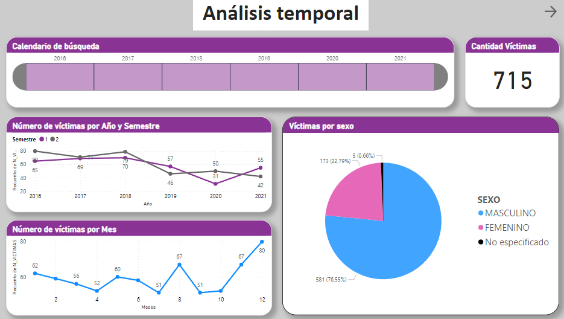

### Página 2: Análisis Geográfico

#### En esta página se presenta un análisis geográfico mediante un mapa interactivo que muestra la distribución de los accidentes. Se pueden aplicar diversos filtros, como año, semestre, comuna, tipos de calle, sexo y edad, para visualizar y analizar la distribución espacial de los siniestros viales.

    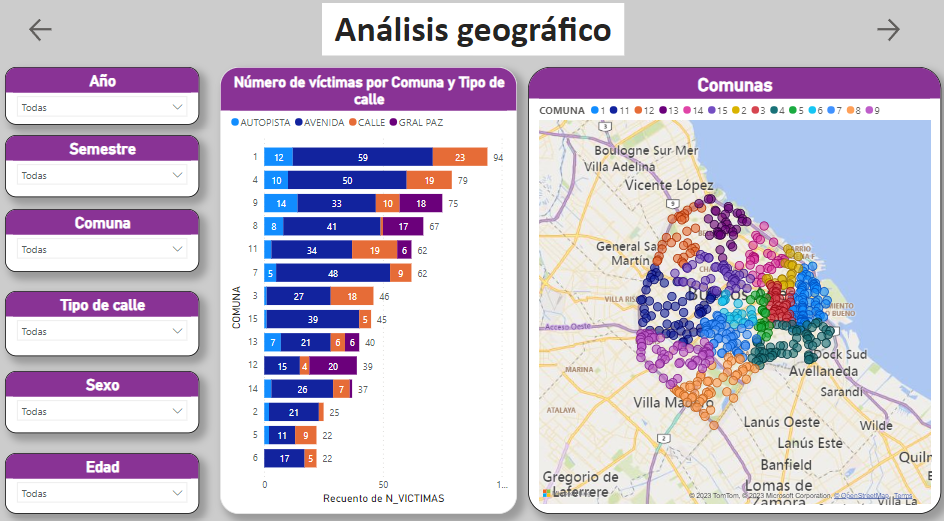

### Página 3: Primer KPI - Reducción de Accidentalidad

#### En esta sección se evalúa el primer KPI propuesto: la reducción del 10% de las cifras de accidentes respecto al semestre anterior. Se presentan análisis específicos y métricas relevantes para determinar si se ha cumplido con este objetivo.

    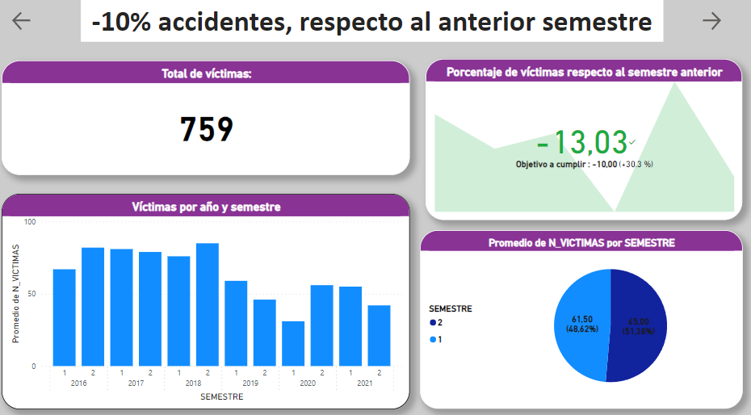

### Página 4: Segundo KPI - Reducción de Accidentalidad en Moto

#### La última página del dashboard se centra en el segundo KPI propuesto, que analiza la reducción de la accidentalidad en moto respecto al año anterior. Se presentan datos y métricas que evalúan el cumplimiento de esta meta específica.

    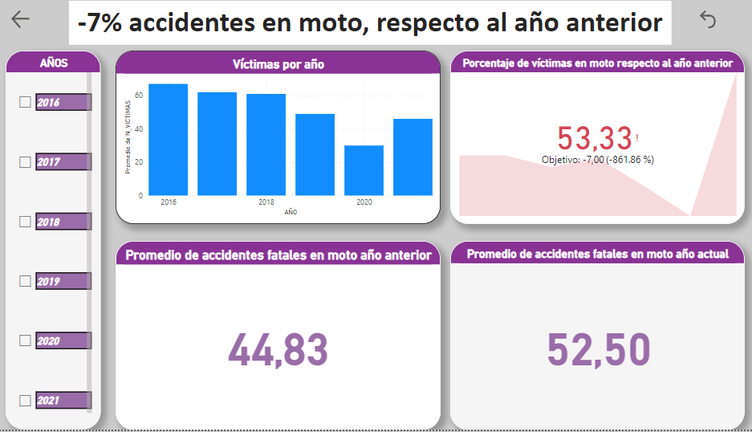

## Archivos Disponibles

### Notebooks:

####    - "1 Análisis inicial.ipynb"
####    - "2 ETL.ipynb"
####    - "3 EDA.ipynb"

### Dashboard

### Carpeta "Data" con:

####    - Datasets recibidos (Excel)
####    - Material complementario (PDFs)
####    - Archivos generados para EDA y dashboard (CSVs)

### Carpeta "IMG" con las imágenes usadas en este readme